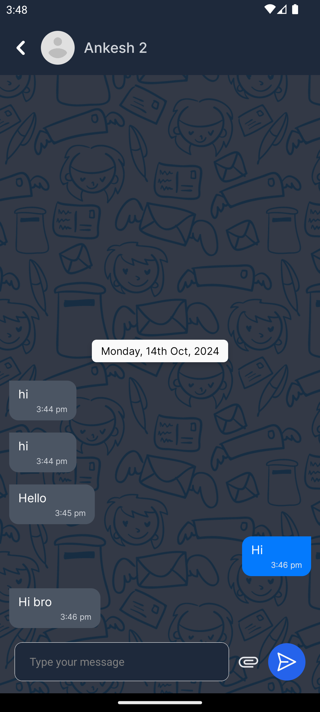

# Description

App name - **BlinkTalk**

BlinkTalk is a cross-platform Real-time Chat Application which is made using React Native.

## Features

- Supports both One-to-one and Group chats.
- Real-time push notifications.
- Real-time typing indicator.
- Supports file-attachment.
- Both light and dark mode support.

## Demo

## Tech Stack

- React Native with Typescript.
- Socket.io-client for handling real-time socket events.
- Firebase Cloud Messaging (FCM) for real-time push notifications.
- Notifee for showing and interacting with notifications.
- Axios to call APIs.
- ContextAPI for global state-management.

## Screenshots

| LOGIN                      | HOME TAB                      | PROFILE TAB                  |
| -------------------------- | ----------------------------- | ---------------------------- |
|  |  |  |

| HOME TAB (DARK)                   | NOTIFICATION-1                     | NOTIFICATION-2                     |
| --------------------------------- | ---------------------------------- | ---------------------------------- |
|  |  |  |

| CHAT CREATION                      | CHAT                      | CHAT (DARK)                    |
| ---------------------------------- | ------------------------- | ------------------------------ |
|  |  |  |

| FILE ATTACHMENT                        | CHAT WITH ATTACHMENT                   | MEDIA VIEWER                     |
| -------------------------------------- | -------------------------------------- | -------------------------------- |
|  |  |  |
